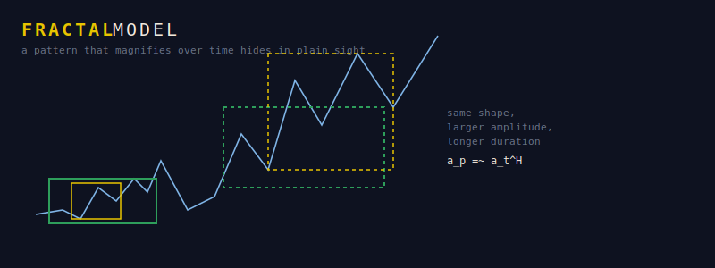

# Fractal Model

A local desktop application that detects **self-similar price patterns across
scale** and projects them forward — working *solely* on fractal structure
(price, time, shares outstanding), with no fundamentals, sentiment, or macro
inputs.

It renders each stock as a **3D fractal** (time × shares outstanding × price),
so the geometry reads as **company valuation** rather than order flow — since
`log(market cap) = log(price) + log(shares)`, buybacks and dilution visibly
bend the path. It boxes the recurring motifs it finds, and — critically —
**backtests itself out-of-sample against a naive baseline and shows you the
verdict**, because a pattern model that can't be falsified is astrology with a
nicer chart.



## What it does

- **3D fractal visualizer** — search any ticker, rotate its time/shares/price
  valuation fractal, see detected self-affine motifs as colored boxes (a 3D
  generalization of hand-drawn chart annotations). **Boxes sharing a color are
  the same recurring pattern**: occurrences are clustered into families in
  shape space, and each family's translucent box marks the live window it
  refers to (the 2D view letters them — `A` historical, `A′` live). Hover
  shows price, share count, and market cap per day; tickers without share
  data fall back to a flat shares axis. Buy zone and sell target are marked
  directly on the projected 3D path, axes are labeled in real dollars and
  share counts (log-scaled, never raw logs), and a one-sentence bubble under
  the chart explains each pattern — e.g. "Pattern E: after its 1 historical
  occurrence price averaged −27% over the next ~21 trading days — a downtrend
  may follow once the live fractal completes." The depth axis is shares outstanding
  rather than volume by design: motif matching runs on price shape alone, so
  the third axis is context, and slow-moving valuation context (buybacks,
  dilution) reads better than daily volume noise.
- **Option-chain fractal** — one button switches the whole chart to the
  listed option chain: each expiration's price-vs-strike curve is a ribbon in
  (days-to-expiry × log strike × log price) space, and ribbons are colored by
  the same shape-family machinery, exposing the term structure's
  self-similarity. The space under each ribbon is filled with a curtain
  shaded by **model-expected profit at expiry** — buy the call at today's
  price, settle at the fractal projection's spot for that date; green means
  the projected payoff exceeds the premium, red means expected loss (also on
  hover). Calls solid, puts dim, spot marked.
- **Percent loading bars** — every chart render reports real stage-based
  progress (fetching history, matching motifs per scale, downloading chain
  expirations, walk-forward anchors) instead of an indeterminate spinner.
- **All-scales projection** — from ~3-month to ~4-year patterns, each with a
  buy zone, sell target, timeframe, and an explicit confidence score, ranked by
  confidence.
- **Top-10 following fractals** — scans a universe and lists the strongest
  current fractal setups with buy/sell/timeframe.
- **Walk-forward backtest** — measures direction hit rate, trade hit rate, and
  error on data the model never saw, versus a naive-drift baseline. The verdict
  is shown plainly, green or red.

## The math (short version)

Prices are treated as **self-affine**: rescaling time by `a` and price by `a^H`
leaves the process statistically unchanged, where `H` is the **Hurst exponent**
(estimated by DFA and R/S). Windows are compared in **shape space** (log-price
normalized, time resampled), and a candidate recurrence is only trusted if its
time/amplitude magnification obeys the series' own scaling law `a_p ≈ a_t^H`.
**Multifractal** richness (MF-DFA singularity width `Δα`) and DFA fit quality
feed a transparent confidence score. Full derivation:
[`docs/PROJECT_SPEC.md`](docs/PROJECT_SPEC.md).

## Install & run

```bash
pip install -r requirements.txt
python -m fractal_model.app
# your browser opens at http://127.0.0.1:8050
```

On Windows you can instead double-click `run_fractal_model.bat`, and put a
**desktop shortcut** in place with:

```powershell
powershell -ExecutionPolicy Bypass -File scripts\create_desktop_shortcut.ps1
```

That creates a "Fractal Model" icon on your Desktop that starts the server and
opens the app in your browser; closing the console window stops it.

First run fetches price history from Yahoo Finance (Stooq fallback) and shares
outstanding from Yahoo (filings-derived history where available, otherwise the
current count) and caches both locally.

## Honest status

On the tickers tested so far, the fractal signal does **not** yet beat a naive
drift baseline at every scale — see the Backtest tab and §0/§9 of the spec. The
promising sign is a positive confidence↔accuracy correlation. This is a research
instrument for finding and stress-testing fractal structure, **not** investment
advice and **not** a forecast.

## License

GNU AGPLv3 — see [`LICENSE`](LICENSE). Network use is distribution: if you run a
modified version as a service, you must offer users its source.
